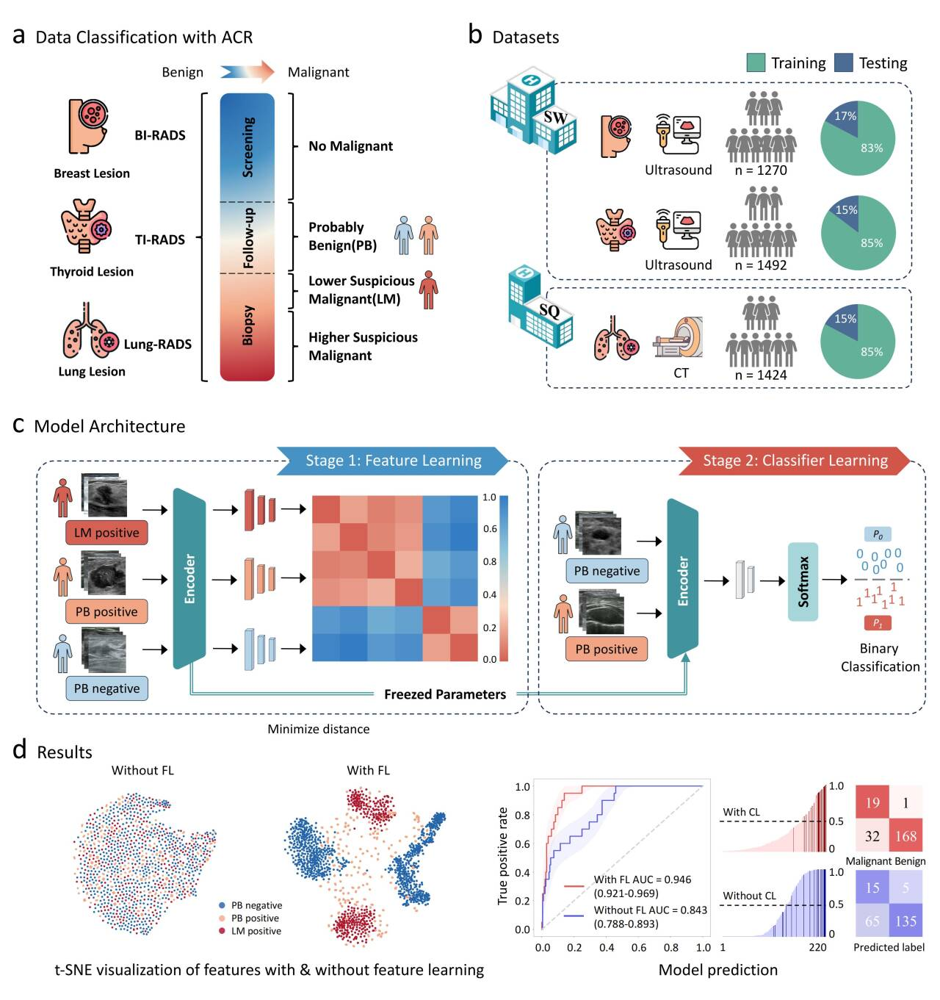

A Deep Learning System to Discriminate Early Cancer from Probably Benign Lesions Assessed with Reporting and Data Systems
====
**This is a Pytorch metacode of a deep learning system for discriminating early malignant lesions from probably benign lesions.This system includes more positive samples from lower suspicious malignant lesions that were also assessed with RADS and employs contrastive learning for learning more features of malignant lesions.** 



## 1.Requirements

  * PyTorch 2.2.2+cu121
  * Python 3.8
  * Albumentations
  * Pytorch_grad_cam

## 2.Usage

```config.py```   For parameter setting and Data augmentation for images.

```contrastiveloss.py```   Used for contrastive learning loss function calculation.

```dataset.py```   For constructing your all dataset class.

```Grad-CAM.py```   Ensemble Grad-Cam implementation on testing dataset.

```preprocess_images.py```   Dataset preprocess.

```stage1.py```   Feature learning through contrastive learning.

```stage2_Fold.py```  Train a classifier through five fold cross validation.

```stage2_Fold_without.py```   Models without feature learning train classifiers through five fold cross validation.

```test.py```   Load trained and weighted file for test the performance.

```test_without.py```     Load trained and weighted files to test the performance of classifiers that did not pass feature learning.

```utils.py```   For evaluation indicators and tools function.

```t-SNE.py ```   Used for drawing t-SNE images


## 3.Data

In order to use your own data, you have to provide txt file for training and testing.

You have a look at the `Lesion Data` for an example.

## 4.Models

You can choose between the following models in Nets file: 


* `ResNet`: Deep residual learning for image recognition. in Proceedings of the IEEE conference on computer vision and pattern recognition 770-778 (2016).
* `VGG`: Very deep convolutional networks for large-scale image recognition. (2014).
* `EfficienNet`: Efficientnetv2: Smaller models and faster training. in International Conference on Machine Learning 10096-10106 (PMLR, 2021).

## 5.Load the pretraining weights of ultrasound datasets
You can get the weights from [https://huggingface.co/MedicalUS/EDL-BC/tree/main](https://huggingface.co/MedicalUS/EDL-BC/tree/main).
Then, this python file (```test.py```) can load the pretraining weights for your own breast ultrasound training or making a prediction. 


